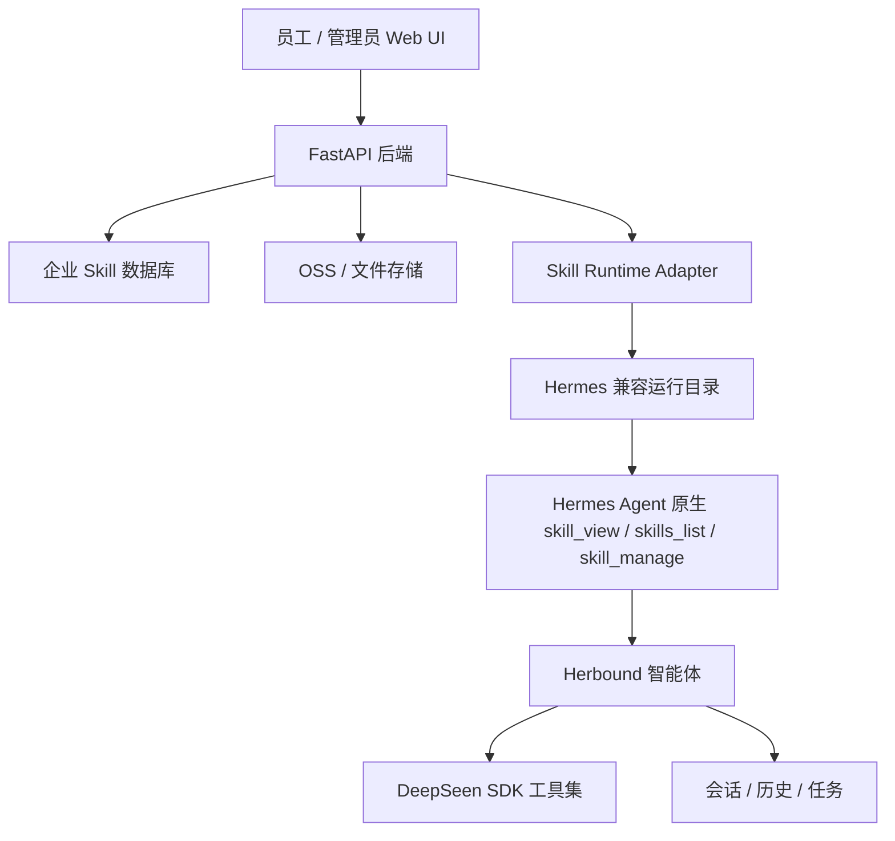

# Herbound 企业级 Skill 知识库产品方案

日期：2026-06-18  
适用项目：`hermes-agent-main` / Herbound  
目标读者：产品、后端、前端、算法/智能体工程、运维

## 1. 背景

Hermes 当前的 skill 机制非常有价值：智能体可以把稳定流程沉淀成 `SKILL.md`，下次遇到类似任务时复用。这一点非常适合 Herbound 做企业知识资产沉淀。

但当前 Hermes 的 skill 设计仍偏本地单用户：

- skill 主要存放在 `~/.hermes/skills/`。
- skill 以文件夹和 `SKILL.md` 为核心。
- profile 通过本地 config 控制启用/禁用。
- agent 通过 `skill_manage` 在本地创建、编辑、删除 skill。
- skill 的搜索、加载、命令补全、prompt 注入都依赖本地文件扫描。

这套机制适合个人智能体，但不适合企业线上化。企业需要的是：skill 跟随企业走，而不是跟随某台机器、某个本地用户、某个 profile 文件夹走。

## 2. 产品目标

建设 Herbound 企业级 Skill 知识库，让企业员工可以共享、沉淀、审核和复用公司内部的业务技能。

核心目标：

- skill 属于企业、部门、团队或项目，而不是单机本地用户。
- 员工进入企业空间后，自动获得对应权限下的 skill。
- 智能体仍能兼容 Hermes 原有 skill 加载和 `skill_view` / `skill_manage` 机制。
- 企业可以对 skill 做版本管理、审核发布、回滚、权限控制和使用统计。
- 智能体在完成复杂任务后，可以沉淀草稿 skill，但不能绕过企业审核直接污染生产知识库。
- skill 可以绑定 DeepSeen 工具、业务 SOP、行业知识、提示词模板、字段展示规则、案例素材。
- 现有功能、工具、skill、prompt、业务规则、展示模板都应逐步数据库化，由后端统一调配，而不是长期依赖 MD 文件或本地目录引入。

## 3. 当前 Hermes Skill 机制摘要

当前代码中的关键点：

- `tools/skills_tool.py`
  - 负责扫描 skill。
  - 当前核心目录是 `SKILLS_DIR = HERMES_HOME / "skills"`。
  - 提供 `skills_list`、`skill_view`。

- `tools/skill_manager_tool.py`
  - 负责创建、编辑、patch、删除 skill。
  - 默认写入 `~/.hermes/skills/`。
  - 支持 `SKILL.md`、`references/`、`templates/`、`scripts/`、`assets/`。

- `agent/prompt_builder.py`
  - 构造系统 prompt 时会生成 skills index。
  - skill 内容会影响模型行为。
  - 有 skills prompt cache，不能频繁破坏会话缓存。

- `agent/skill_commands.py`
  - 将 skill 暴露成 slash command。
  - 依赖本地 skill 目录扫描。

- `hermes_cli/web_server.py`
  - 已有 `/api/skills`、`/api/skills/content`、`/api/skills/toggle`、`/api/skills` 创建、更新等接口。
  - 当前仍是围绕 profile 本地 skill 文件目录管理。

结论：当前 Hermes skill 是一个优秀的本地 procedural memory，但不是企业级知识库。

## 4. 设计原则

### 4.1 数据库为主，文件兼容层为辅

企业线上化后，skill 的主数据必须在数据库中。文件系统只作为 Hermes 运行时兼容层。

不能让数据库和本地文件同时成为主数据，否则会出现版本冲突、权限绕过、同步不一致。

同样的原则也适用于现有功能配置：

- 工具启用规则不应只写死在本地配置或插件文件中。
- prompt/profile 不应只依赖本地 markdown 或 yaml。
- 结果展示字段不应散落在 skill 文本或代码分支中。
- 业务模板、字段翻译、工具参数说明、权限范围都应进入数据库统一管理。
- MD 文件可以作为导入、导出、版本预览、兼容 Hermes 的渲染产物，但不应作为生产主数据。

### 4.2 Skill 跟随企业走

用户登录后进入企业空间，系统根据企业、部门、角色、项目、profile 计算用户可用 skill 集合。

员工换电脑、换浏览器、换容器，skill 不应丢失。

### 4.3 智能体可以沉淀，但必须有治理

Herbound 可以让 agent 自动生成 skill 草稿，但进入企业生产知识库前必须经过：

- 归属确认。
- 安全扫描。
- 人工审核。
- 版本发布。
- 权限范围配置。

### 4.4 保持 Hermes 兼容

短期不建议大改 Hermes agent loop。最稳妥的方案是：

- 数据库存企业 skill。
- 会话启动或 skill 变更时，将可用 skill materialize 到运行时工作目录。
- Hermes 仍然从一个“虚拟的 SKILLS_DIR”读取 `SKILL.md`。
- 后续再逐步替换成本地扫描 + 数据库 provider 双模式。

这里需要明确：`SKILL.md` 是兼容层输出，不是产品层主数据。开发时可以继续让 Hermes 读取 `SKILL.md`，但这些文件应由数据库内容生成，不能让人工长期直接维护线上运行目录。

### 4.5 不破坏 prompt cache

同一会话开始后，skill 集合应稳定。不能在每一轮对话动态变化已加载 skill，否则会破坏 Hermes 原有“长会话 prompt cache”的核心设计。

建议：

- 会话创建时冻结 skill snapshot。
- 会话中只允许显式刷新 skill。
- 企业 skill 发布后只影响新会话，或用户点击“刷新技能”后影响当前会话。

## 5. 产品形态

### 5.1 企业 Skill 知识库

这是一个企业级后台模块，用于管理公司所有 skill。

核心页面：

- Skill 列表
- Skill 详情
- 新建 Skill
- 编辑 Skill
- 审核发布
- 版本记录
- 权限范围
- 使用统计
- 失败反馈
- 智能体推荐沉淀

### 5.2 员工侧 Skill 使用

员工不需要理解 `SKILL.md`。员工看到的是业务能力：

- 商品分析 SOP
- TikTok 竞品分析流程
- 达人筛选标准
- 图片二创规范
- 视频脚本生成规范
- 美国市场选品规则
- 东南亚市场素材规范
- 公司品牌风格要求

员工使用方式：

- 在聊天中自然语言触发。
- 在技能页选择技能。
- 在任务模板中选择技能。
- 通过管理员配置默认加载。

### 5.3 智能体自沉淀闭环

当智能体完成复杂任务后，可以提出：

- “本次流程可以沉淀为企业技能草稿。”
- “建议归类为：竞品分析 / 美国市场 / 女装类目。”
- “建议适用范围：跨境运营组。”

然后进入草稿池，由管理员或业务负责人审核。

## 6. 数据模型设计

建议新增独立数据库模块：`enterprise_skill_db`。

如果当前生产仍用 SQLite，可以先在 FastAPI 后端中使用 SQLite/PostgreSQL 兼容 ORM。正式生产建议 PostgreSQL。

### 6.1 organizations

企业表。

| 字段 | 类型 | 说明 |
| --- | --- | --- |
| id | uuid | 企业 ID |
| name | text | 企业名称 |
| slug | text | 企业唯一标识 |
| status | text | active / disabled |
| created_at | datetime | 创建时间 |
| updated_at | datetime | 更新时间 |

### 6.2 users

用户表可复用现有 auth 用户，但需要补企业关系。

| 字段 | 类型 | 说明 |
| --- | --- | --- |
| id | uuid/int | 用户 ID |
| organization_id | uuid | 所属企业 |
| username | text | 用户名 |
| role | text | super_admin / org_admin / skill_admin / member |
| status | text | active / disabled |

### 6.3 teams

团队或部门表。

| 字段 | 类型 | 说明 |
| --- | --- | --- |
| id | uuid | 团队 ID |
| organization_id | uuid | 企业 ID |
| name | text | 团队名称 |
| parent_id | uuid | 上级团队 |

### 6.4 user_team_memberships

用户与团队关系。

| 字段 | 类型 | 说明 |
| --- | --- | --- |
| user_id | uuid/int | 用户 ID |
| team_id | uuid | 团队 ID |
| role | text | owner / admin / member |

### 6.5 skill_definitions

Skill 主表。这里存的是 skill 的身份，不直接存每个版本内容。

| 字段 | 类型 | 说明 |
| --- | --- | --- |
| id | uuid | Skill ID |
| organization_id | uuid | 所属企业 |
| name | text | 机器名，兼容 Hermes skill name |
| display_name | text | 用户可见名称 |
| description | text | 用户可见描述 |
| category | text | 分类 |
| business_domain | text | 业务域，例如 竞品分析、达人分析、素材生成 |
| status | text | draft / review / published / archived |
| latest_version_id | uuid | 最新版本 |
| published_version_id | uuid | 当前生产版本 |
| owner_user_id | uuid/int | 负责人 |
| created_by | uuid/int | 创建人 |
| created_at | datetime | 创建时间 |
| updated_at | datetime | 更新时间 |

约束：

- 同一企业下 `name` 唯一。
- `name` 必须兼容 Hermes 当前 skill 命名规则。

### 6.6 skill_versions

Skill 版本表。

| 字段 | 类型 | 说明 |
| --- | --- | --- |
| id | uuid | 版本 ID |
| skill_id | uuid | Skill ID |
| version | int | 递增版本号 |
| semver | text | 可选语义版本 |
| content_md | text | SKILL.md 完整内容 |
| frontmatter_json | jsonb | 解析后的 frontmatter |
| references_json | jsonb | 关联参考文件索引 |
| templates_json | jsonb | 模板文件索引 |
| assets_json | jsonb | 附件资源索引 |
| tools_json | jsonb | 绑定工具，例如 DeepSeen 工具 |
| changelog | text | 变更说明 |
| status | text | draft / pending_review / approved / rejected / published / archived |
| created_by | uuid/int | 创建人 |
| reviewed_by | uuid/int | 审核人 |
| published_by | uuid/int | 发布人 |
| created_at | datetime | 创建时间 |
| reviewed_at | datetime | 审核时间 |
| published_at | datetime | 发布时间 |

### 6.7 skill_files

存放 references、templates、scripts、assets 等支持文件。

| 字段 | 类型 | 说明 |
| --- | --- | --- |
| id | uuid | 文件 ID |
| skill_version_id | uuid | 版本 ID |
| file_type | text | reference / template / script / asset |
| path | text | 相对路径 |
| content_text | text | 文本内容 |
| object_url | text | OSS/CDN 地址 |
| sha256 | text | 内容 hash |
| size_bytes | int | 大小 |
| created_at | datetime | 创建时间 |

建议：

- 文本类文件存数据库。
- 大文件、图片、视频、模板包存 OSS。
- 所有文件要绑定版本，不能被生产版本直接覆盖。

### 6.8 skill_visibility_rules

Skill 可见性规则。

| 字段 | 类型 | 说明 |
| --- | --- | --- |
| id | uuid | 规则 ID |
| skill_id | uuid | Skill ID |
| scope_type | text | organization / team / user / role / profile |
| scope_id | text | 对应 ID |
| access_level | text | view / use / edit / approve / admin |
| created_at | datetime | 创建时间 |

规则解释：

- 企业级 skill：所有员工可用。
- 团队级 skill：指定团队可用。
- 用户级 skill：只对个人可用。
- profile 级 skill：绑定某个智能体 profile。
- 角色级 skill：如运营、设计、客服等角色可用。

### 6.9 skill_runtime_snapshots

会话级 skill 快照表。

| 字段 | 类型 | 说明 |
| --- | --- | --- |
| id | uuid | 快照 ID |
| organization_id | uuid | 企业 ID |
| user_id | uuid/int | 用户 ID |
| session_id | text | 会话 ID |
| profile_id | text | Profile |
| skill_ids_json | jsonb | 本次会话可用 skill |
| version_ids_json | jsonb | 本次会话锁定版本 |
| snapshot_hash | text | 快照 hash |
| created_at | datetime | 创建时间 |

作用：

- 保证同一会话 skill 集合稳定。
- 便于复盘某次对话到底使用了哪个版本的 skill。
- 避免发布新 skill 破坏正在进行的长会话。

### 6.10 skill_usage_events

Skill 使用日志。

| 字段 | 类型 | 说明 |
| --- | --- | --- |
| id | uuid | 事件 ID |
| organization_id | uuid | 企业 ID |
| user_id | uuid/int | 用户 ID |
| session_id | text | 会话 ID |
| skill_id | uuid | Skill ID |
| skill_version_id | uuid | Skill 版本 |
| event_type | text | listed / viewed / invoked / patched / failed |
| tool_name | text | 相关工具 |
| request_id | text | 请求链路 ID |
| metadata_json | jsonb | 额外信息 |
| created_at | datetime | 时间 |

### 6.11 skill_feedback

用户反馈。

| 字段 | 类型 | 说明 |
| --- | --- | --- |
| id | uuid | 反馈 ID |
| skill_id | uuid | Skill ID |
| skill_version_id | uuid | 版本 ID |
| user_id | uuid/int | 用户 |
| rating | int | 评分 |
| feedback_text | text | 反馈内容 |
| session_id | text | 来源会话 |
| created_at | datetime | 时间 |

## 7. 架构设计

### 7.1 总体架构



### 7.2 核心模块

#### EnterpriseSkillService

企业 skill 业务服务。

职责：

- 创建 skill。
- 编辑草稿。
- 提交审核。
- 发布版本。
- 回滚版本。
- 计算用户可用 skill。
- 记录使用事件。
- 处理 agent 生成的 skill 草稿。

#### SkillRuntimeAdapter

Hermes 兼容层。

职责：

- 根据 `organization_id + user_id + profile_id + session_id` 生成 skill snapshot。
- 将数据库中的 skill 渲染为 Hermes 可读取的目录结构。
- 将 `SKILL.md`、references、templates、assets materialize 到运行时目录。
- 提供一个 profile/session scoped `SKILLS_DIR` 给 Hermes 原生代码读取。

建议运行时目录：

```text
/opt/data/runtime-skills/
  org_<org_id>/
    snapshots/
      <snapshot_hash>/
        crossborder/
          competitor-analysis/
            SKILL.md
            references/
            templates/
```

这个目录是缓存，不是主数据。可以删除后从数据库重建。

#### SkillGovernanceService

治理服务。

职责：

- 安全扫描。
- prompt 注入检测。
- 字段完整性检查。
- 命名规则校验。
- 审核流。
- 发布流。
- 回滚。
- 删除与归档。

#### SkillRecommendationService

自沉淀建议服务。

职责：

- 从会话中识别可沉淀流程。
- 生成 skill 草稿。
- 自动归类。
- 推荐可见范围。
- 提供给管理员确认。

## 8. 与 Hermes 兼容的实现路径

### 8.0 数据库统一调配范围

Herbound 企业化后，不应只把 skill 数据库化，而应把现有核心功能逐步纳入统一数据库调配体系。

建议数据库化范围：

| 模块 | 当前常见形态 | 目标形态 |
| --- | --- | --- |
| Skill | `SKILL.md` 文件夹 | `skill_definitions` + `skill_versions` |
| Prompt/Profile | 本地 config、markdown、yaml | 企业级 prompt/profile 表 |
| 工具启用规则 | plugin.yaml、本地配置 | 企业/角色/profile 工具策略表 |
| DeepSeen 工具参数说明 | skill 文本、代码描述 | 工具 schema 表 + 字段翻译表 |
| 结果展示规则 | 代码分支、prompt 约束 | 输出 schema 表 + renderer 配置表 |
| 业务 SOP | markdown 文档 | SOP/流程模板表 |
| 示例案例 | references 目录 | 案例库表 + OSS 资源 |
| 权限范围 | 本地 profile disabled list | 企业 RBAC/ABAC 权限表 |
| 使用统计 | 日志或本地 usage | 统一事件表 |

数据库化后的目标是：

- 后端可以按企业、团队、角色、用户、profile、会话统一计算可用能力。
- 前端看到的是数据库中的真实业务能力，而不是扫描本地目录后的文件列表。
- 智能体加载的是会话级能力快照，而不是随时变化的本地文件。
- 开发和运维可以通过后台调整工具、prompt、展示规则，不需要改代码或手动改 MD。
- 所有变更都有版本、审核、发布、回滚和审计。

MD 文件未来的角色：

- 作为 Hermes 兼容运行时的生成物。
- 作为导入导出格式。
- 作为版本 diff 和人工 review 的展示格式。
- 作为开发调试格式。

MD 文件不再承担：

- 生产主数据。
- 权限来源。
- 发布状态来源。
- 企业知识库的唯一存储。

### 8.1 第一阶段：数据库 + 文件镜像

这是最低风险方案。

实现方式：

1. 企业 skill 存数据库。
2. 用户创建会话时，后端计算可用 skill。
3. 后端生成 `skill_runtime_snapshot`。
4. 后端把 snapshot 中的 skill 写入运行时缓存目录。
5. 当前请求或会话运行时，把 Hermes 的 `SKILLS_DIR` 指向该 snapshot 目录。
6. Hermes 原有 `skills_list`、`skill_view`、slash command、prompt builder 继续工作。

优点：

- 不大改 Hermes 内核。
- 兼容现有 prompt_builder 和 skill command。
- 兼容 `SKILL.md` 生态。
- 风险低，开发周期短。

缺点：

- 仍有运行时文件镜像。
- 需要处理 snapshot 目录清理。
- 需要谨慎处理 prompt cache。

### 8.2 第二阶段：SkillProvider 抽象

中期可以抽象 skill provider：

```python
class SkillProvider:
    def list_skills(context) -> list[SkillMeta]:
        ...

    def get_skill(name, context) -> SkillDocument:
        ...

    def write_skill(change, context) -> SkillWriteResult:
        ...
```

Provider 类型：

- LocalFileSkillProvider：兼容 Hermes 本地。
- EnterpriseDbSkillProvider：企业数据库。
- HubSkillProvider：外部 skill hub。

优点：

- 从根上解决本地文件依赖。
- 更适合长期维护。

缺点：

- 需要修改 `tools/skills_tool.py`、`tools/skill_manager_tool.py`、`agent/prompt_builder.py`、`agent/skill_commands.py`。
- 要特别注意 prompt cache 和性能。

### 8.3 第三阶段：企业知识编排

长期可以把 skill、工具、知识文档、SOP、模板、案例统一成“企业能力资产”。

Skill 不再只是 `SKILL.md`，而是：

- 指令
- 业务规则
- 工具绑定
- 输入表单
- 输出 schema
- 示例案例
- 审核规则
- 指标统计

## 9. Skill 生命周期

### 9.1 人工创建

1. 管理员在 Skill 管理后台新建 skill。
2. 填写名称、描述、分类、适用范围。
3. 编写或粘贴 `SKILL.md`。
4. 绑定 DeepSeen 工具或其他工具。
5. 提交审核。
6. 审核通过后发布。
7. 发布后对目标企业/团队/角色生效。

### 9.2 智能体自沉淀

1. 员工完成一个复杂任务。
2. 智能体判断该流程值得沉淀。
3. 智能体生成 skill 草稿。
4. 草稿进入“待审核沉淀池”。
5. 管理员查看草稿来源会话、内容、建议分类、建议适用范围。
6. 管理员修改后发布。
7. 发布后成为企业 skill。

### 9.3 更新与回滚

1. 编辑已有 skill 会生成新版本草稿。
2. 审核通过后成为新生产版本。
3. 老版本保留。
4. 出现问题可以一键回滚到旧版本。
5. 已经运行中的会话继续使用自己的 snapshot，不受新版本影响。

### 9.4 归档

Skill 不建议物理删除。删除应改为归档。

归档后：

- 新会话不再加载。
- 历史会话仍能追溯。
- 管理员可恢复。

## 10. 权限设计

### 10.1 角色

建议角色：

- `super_admin`：平台超级管理员。
- `org_admin`：企业管理员。
- `skill_admin`：企业技能管理员。
- `skill_reviewer`：技能审核员。
- `team_admin`：团队管理员。
- `member`：普通员工。

### 10.2 权限矩阵

| 操作 | super_admin | org_admin | skill_admin | skill_reviewer | team_admin | member |
| --- | --- | --- | --- | --- | --- | --- |
| 查看企业 skill | 是 | 是 | 是 | 是 | 团队内 | 有权限范围内 |
| 使用 skill | 是 | 是 | 是 | 是 | 团队内 | 有权限范围内 |
| 创建草稿 | 是 | 是 | 是 | 是 | 是 | 可选 |
| 编辑 skill | 是 | 是 | 是 | 待定 | 团队内 | 否 |
| 审核发布 | 是 | 是 | 是 | 是 | 否 | 否 |
| 回滚版本 | 是 | 是 | 是 | 否 | 否 | 否 |
| 配置可见范围 | 是 | 是 | 是 | 否 | 团队内 | 否 |
| 查看使用统计 | 是 | 是 | 是 | 可选 | 团队内 | 自己 |

### 10.3 智能体写入限制

智能体不能直接写入 published skill。

`skill_manage` 在线上应改为：

- 对个人草稿：可以直接创建。
- 对团队/企业草稿：创建 pending review。
- 对 published skill：只能创建 patch proposal。
- 删除：只能创建 archive proposal。

## 11. API 设计

建议新增企业 skill API，不直接复用当前 `/api/skills` 的本地文件语义。

### 11.1 Skill 列表

`GET /api/enterprise/skills`

参数：

- `scope`
- `category`
- `status`
- `keyword`
- `page`
- `page_size`

返回：

- skill ID
- 名称
- 描述
- 分类
- 状态
- 当前版本
- 适用范围
- 最近使用时间

### 11.2 Skill 详情

`GET /api/enterprise/skills/{skill_id}`

返回：

- 基础信息
- 当前生产版本
- 草稿版本
- 权限规则
- 绑定工具
- 最近使用统计

### 11.3 创建 Skill

`POST /api/enterprise/skills`

创建 skill definition 和第一个 draft version。

### 11.4 更新草稿

`PUT /api/enterprise/skills/{skill_id}/draft`

更新草稿内容。

### 11.5 提交审核

`POST /api/enterprise/skills/{skill_id}/submit-review`

### 11.6 审核通过

`POST /api/enterprise/skills/{skill_id}/approve`

### 11.7 发布

`POST /api/enterprise/skills/{skill_id}/publish`

### 11.8 回滚

`POST /api/enterprise/skills/{skill_id}/rollback`

参数：

- `target_version_id`

### 11.9 归档

`POST /api/enterprise/skills/{skill_id}/archive`

### 11.10 获取当前用户可用 Skill

`GET /api/enterprise/skills/available`

参数：

- `profile_id`
- `session_id`

返回：

- 本用户当前可用 skill 列表。
- 被锁定的版本号。
- snapshot hash。

### 11.11 创建运行时快照

`POST /api/enterprise/skills/runtime-snapshot`

由会话创建时调用。

返回：

- `snapshot_id`
- `snapshot_hash`
- `runtime_skills_dir`
- `skill_count`

### 11.12 智能体提交沉淀草稿

`POST /api/enterprise/skills/proposals`

来源：

- agent 自动沉淀。
- 用户手动提交。
- 管理员导入。

## 12. 前端页面设计

### 12.1 企业技能库

页面路径建议：

- `/hermes/enterprise-skills`

列表字段：

- 技能名称
- 业务分类
- 适用团队
- 当前版本
- 状态
- 最近更新时间
- 使用次数
- 负责人

操作：

- 新建技能
- 查看详情
- 编辑草稿
- 提交审核
- 发布
- 回滚
- 归档

### 12.2 Skill 详情页

模块：

- 基本信息
- 当前生产版本
- 草稿版本
- 内容预览
- 支持文件
- 绑定工具
- 权限范围
- 版本记录
- 使用数据
- 用户反馈

### 12.3 审核中心

页面路径建议：

- `/hermes/skill-review`

展示：

- 待审核 skill 草稿。
- agent 自动沉淀建议。
- 差异对比。
- 安全扫描结果。
- 来源会话。
- 审核意见。

### 12.4 员工技能页

页面路径建议：

- `/hermes/skills`

普通员工看到的是业务技能，不是底层 `SKILL.md`：

- 竞品分析
- 多竞品分析
- 产品报告
- 达人分析
- 图片智创
- 图片二创
- 视频智创
- 视频二创
- 视频分析
- 市场 SOP
- 平台运营规范

每个技能展示：

- 能做什么。
- 需要提供什么。
- 输出什么。
- 适合谁使用。
- 示例问题。

## 13. 与 Herbound 跨境业务的结合

企业 skill 可以分为三层。

### 13.1 平台级基础 Skill

由 Herbound 产品维护，所有企业都有。

示例：

- DeepSeen 工具调用规范。
- 结果展示规范。
- 上传资源处理规范。
- 跨境电商通用字段解释。

### 13.2 企业级业务 Skill

由企业沉淀，跟随企业走。

示例：

- 公司品牌调性。
- 公司选品规则。
- 公司 TikTok Shop 运营 SOP。
- 公司美国市场女装类目分析规则。
- 公司素材审核标准。
- 公司达人合作评分规则。

### 13.3 团队级/项目级 Skill

由部门或项目组沉淀。

示例：

- 女装组竞品分析模板。
- 家居组视频脚本规范。
- 东南亚市场本地化表达规范。
- 某品牌账号专用素材生成规则。

## 14. 运行时加载策略

### 14.1 会话创建时

后端根据上下文计算：

- 企业 ID。
- 用户 ID。
- 用户角色。
- 所属团队。
- 当前 profile。
- 当前业务模式。

然后选择 skill：

```text
平台基础 skill
+ 企业 published skill
+ 团队 published skill
+ 用户个人 enabled skill
+ profile 绑定 skill
- 用户禁用 skill
= 当前会话 skill snapshot
```

### 14.2 会话中

默认不自动改变 skill 集合。

如果管理员发布新 skill：

- 新会话立即生效。
- 老会话保持原 snapshot。
- 老会话可以提示“企业技能库有更新，是否刷新当前会话技能”。

### 14.3 缓存策略

缓存 key：

```text
organization_id:user_id:profile_id:skill_version_hash
```

缓存内容：

- skills index。
- materialized skill directory。
- slash command catalog。

失效条件：

- skill 发布新版本。
- 权限规则变更。
- 用户团队关系变更。
- 用户手动刷新。

## 15. Agent 自沉淀机制设计

### 15.1 什么时候建议沉淀

满足以下任一条件：

- 同类任务重复出现。
- 用户多次纠正某个业务流程。
- 智能体完成了 5 次以上工具调用的复杂流程。
- 解决了某个稳定问题。
- 形成了明确 SOP。
- 某个 DeepSeen 工具结果展示规则被人工修正。

### 15.2 沉淀内容格式

自动草稿应包含：

- 技能名称。
- 技能描述。
- 适用场景。
- 触发条件。
- 必要输入。
- 工具选择规则。
- 输出展示规则。
- 注意事项。
- 来源会话。
- 建议适用范围。

### 15.3 禁止自动沉淀的内容

- 用户隐私。
- API key。
- 客户敏感数据。
- 未脱敏商品数据。
- 一次性任务进度。
- 已过期活动信息。
- 不稳定的临时结论。

## 16. 安全与合规

### 16.1 Prompt 注入扫描

所有 skill 发布前必须扫描：

- ignore previous instructions
- system prompt
- 角色劫持
- 工具滥用
- 文件读取指令
- 诱导泄露密钥

### 16.2 支持文件限制

- `scripts/` 默认禁用或只允许管理员发布。
- `assets/` 必须走 OSS。
- 单文件大小限制。
- 文本文件做敏感词和密钥扫描。

### 16.3 审计

需要记录：

- 谁创建 skill。
- 谁编辑 skill。
- 谁审核 skill。
- 谁发布 skill。
- 哪个会话使用了哪个版本。
- 哪次工具调用由哪个 skill 触发。

### 16.4 多租户隔离

企业之间必须完全隔离：

- skill definition 隔离。
- 文件资源隔离。
- runtime snapshot 隔离。
- 使用日志隔离。
- 搜索索引隔离。

## 17. 迁移方案

### 17.1 当前本地 skill 导入

将现有 `skills/crossborder-deepseen/SKILL.md` 导入为平台基础 skill。

将通用 Hermes skills 标记为：

- 平台系统 skill。
- 默认不对普通企业用户展示。
- 管理员高级模式可见。

### 17.2 用户本地 skill 导入

如果未来需要从老 Hermes 用户迁移：

1. 扫描用户 `~/.hermes/skills`。
2. 解析 frontmatter。
3. 生成个人 skill 草稿。
4. 用户选择是否导入企业。
5. 管理员审核后发布到团队或企业。

### 17.3 当前 `/api/skills` 兼容

短期：

- `/api/skills` 继续服务 Hermes 本地兼容层。
- 新增 `/api/enterprise/skills` 做企业知识库。

中期：

- `/api/skills` 返回当前用户可用 enterprise skill。
- 本地文件 skill 作为 debug/开发模式。

长期：

- 生产环境禁用本地 `skill_manage` 直写。
- 所有 skill 写入走企业审核流。

## 18. 开发拆分建议

### Phase 1：企业 Skill 数据库与管理后台

交付：

- 数据表。
- CRUD API。
- 权限规则。
- Skill 列表和详情页。
- 新建、编辑、审核、发布、回滚。

### Phase 2：Hermes 兼容运行时

交付：

- SkillRuntimeAdapter。
- 会话级 snapshot。
- 数据库 skill materialize 到 runtime dir。
- 当前会话绑定 snapshot。
- `skills_list` / `skill_view` 可读取企业 skill。

### Phase 3：智能体自沉淀

交付：

- Agent 生成 skill proposal。
- 草稿进入审核中心。
- 来源会话关联。
- 安全扫描。
- 发布后新会话生效。

### Phase 4：数据分析与企业运营

交付：

- Skill 使用统计。
- 员工使用排行。
- 失败率。
- 反馈评分。
- 低效 skill 推荐优化。
- 长期未使用 skill 归档建议。

## 19. 最小可行版本

MVP 不要一开始就重构 Hermes 内核。建议先做：

- 企业 skill 数据表。
- 企业 skill CRUD。
- 企业 skill 发布状态。
- 用户可用 skill 计算。
- 会话创建时生成 runtime skill 目录。
- Hermes 继续从目录读取。
- agent 只能创建 skill proposal，不能直接发布。
- 前端做企业技能库和审核中心。

MVP 验收标准：

- 管理员可以新建并发布一个企业 skill。
- 普通员工登录后能看到该 skill。
- 新建会话后该 skill 能被智能体加载。
- 智能体能通过 `skill_view` 读取该 skill。
- 同一企业不同员工共享 skill。
- 不同企业之间互相不可见。
- 更新 skill 后新会话使用新版本，老会话保持旧版本。
- 智能体生成的 skill 只能进入草稿审核池。

## 20. 关键风险

### 20.1 Prompt cache 被频繁破坏

解决：

- 会话级 snapshot。
- 新版本只影响新会话。
- 当前会话显式刷新。

### 20.2 权限绕过

解决：

- 生产环境禁用直接写本地 skill。
- 所有企业 skill 读取必须带 organization_id 和 user_id。
- runtime 目录按 snapshot 生成，不允许用户传任意路径。

### 20.3 Skill 污染

解决：

- 草稿、审核、发布分离。
- agent 只能提案。
- published skill 只能由有权限的人发布。

### 20.4 本地文件和数据库不一致

解决：

- 数据库是唯一主数据。
- runtime 文件是缓存。
- 缓存可随时重建。

### 20.5 多租户数据泄露

解决：

- 所有表都带 organization_id。
- OSS 路径带 org 前缀。
- API 层统一租户过滤。
- 后台任务也必须显式传 organization_id。

## 21. 建议开发结论

Herbound 要做企业线上化，不应继续把 skill 当成本地文件功能扩展，而应把它升级为企业知识资产系统。

推荐方案是：

1. 数据库存储企业 skill 主数据。
2. 会话创建时生成 skill snapshot。
3. 通过 runtime 文件镜像兼容 Hermes 原生 skill 机制。
4. 智能体自沉淀只生成草稿，不直接发布。
5. 管理员审核后 skill 跟随企业、团队、角色生效。
6. 中长期再抽象 SkillProvider，从文件机制过渡到数据库 provider。

这个方案既保留了 Hermes 最有价值的自沉淀能力，也能满足企业线上化对权限、审计、版本、团队共享、多租户隔离和生产稳定性的要求。
